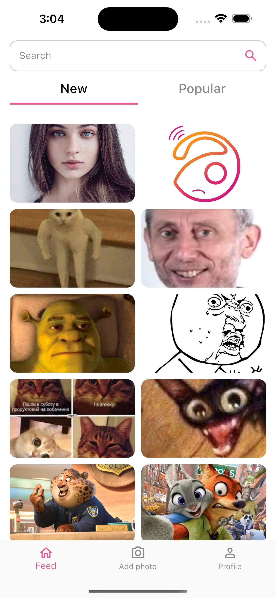
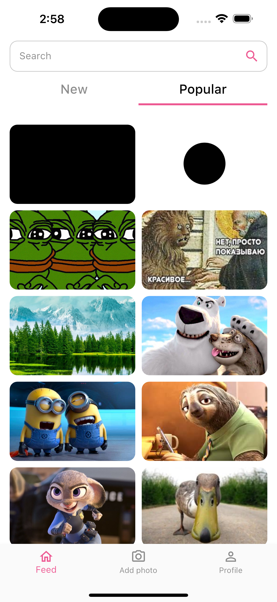
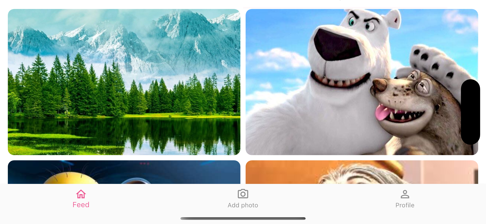
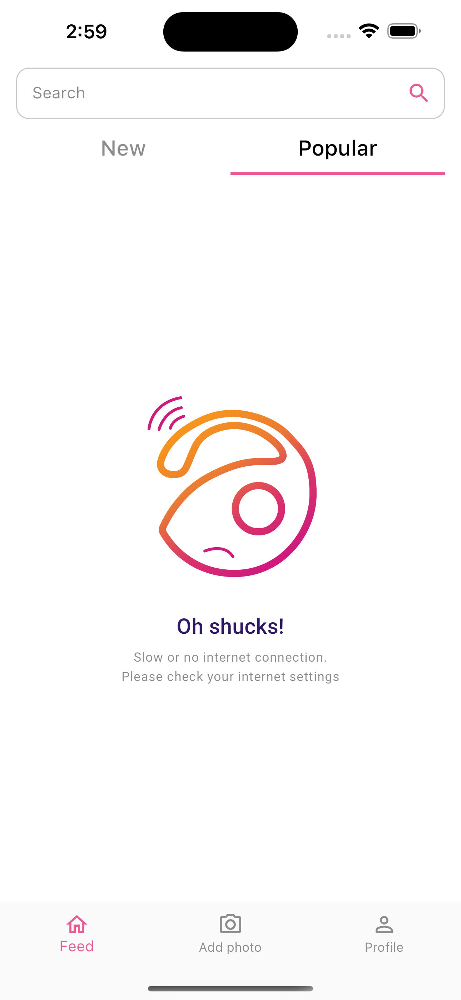
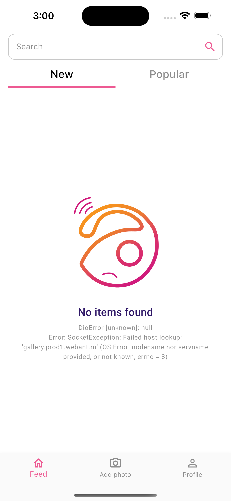

# Gallery App
Test Flutter application for displaying images from API

### Platforms

iOS, Android

### Stack
- Bloc
- Freezed
- AutoRoute
- Dio
- ConnectivityPlus
- RxDart
- InfiniteScrollPagination
- CachedNetworkImage

### Screenshots

1. Tab with new images

2. Tab with popular images

3. Image description

4. Landscape mode

5. Internet connection handling

6. Error handling

